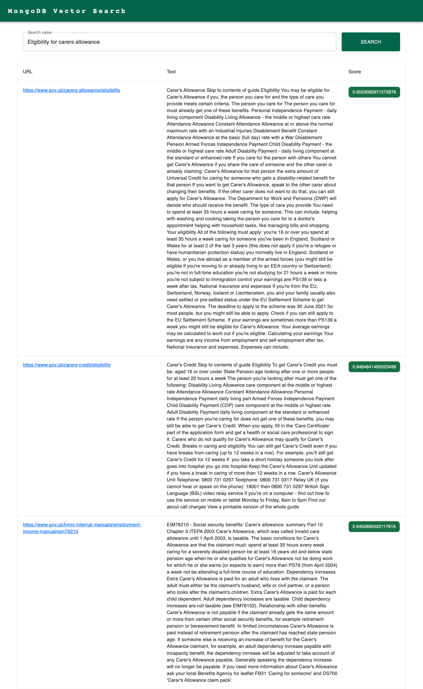

# MongoDB Vector Search UI

This is a simple UI for searching vectors in MongoDB. It uses the [MongoDB Vector Search API](https://www.mongodb.com/docs/atlas/atlas-search/knn-beta/) to search for vectors in a collection.

## Usage

- Clone this repository
- Run `npm install`
- Copy `.env.example` to `.env` and fill in the values in the `/server` folder
- Run `npm run dev --workspace=server` and `npm run dev --workspace=ui`

## Example

